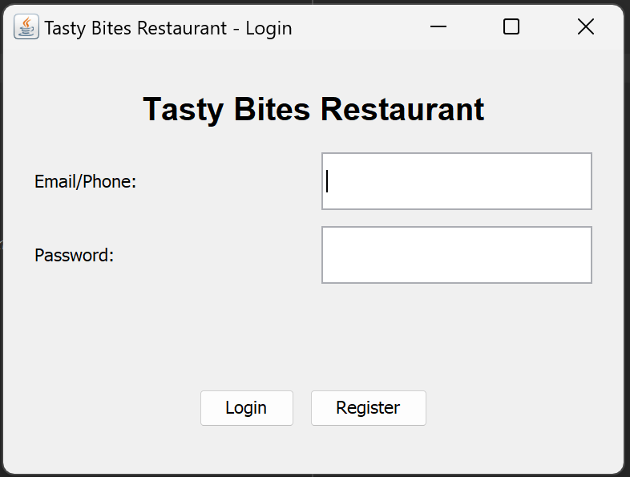
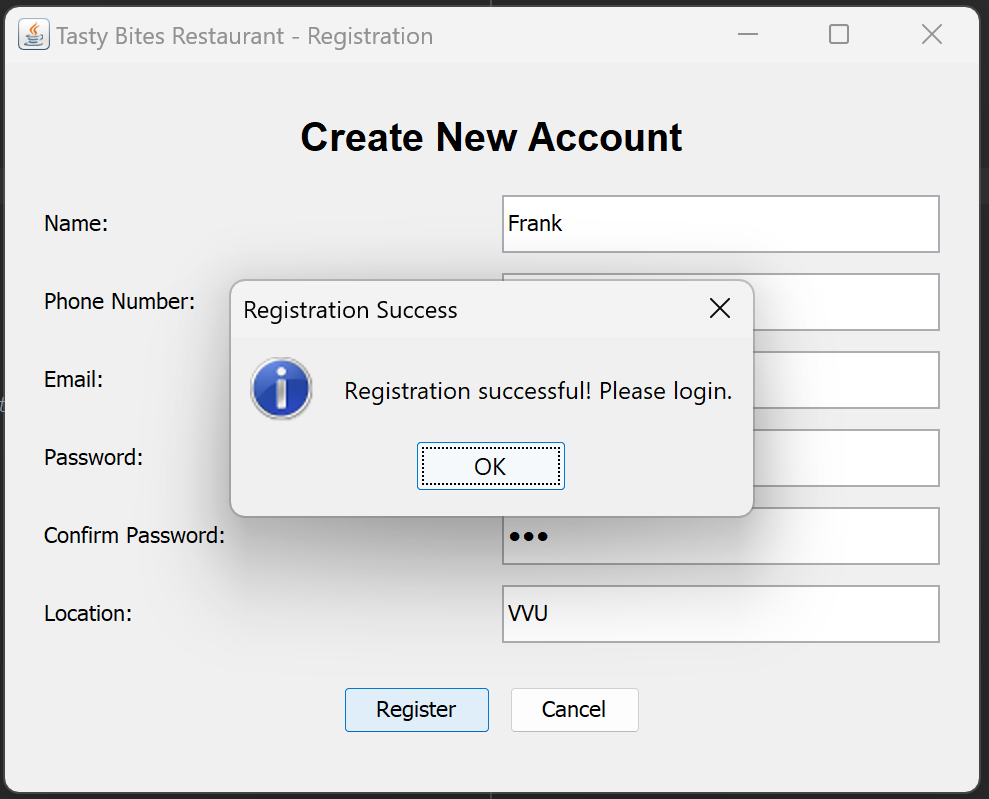
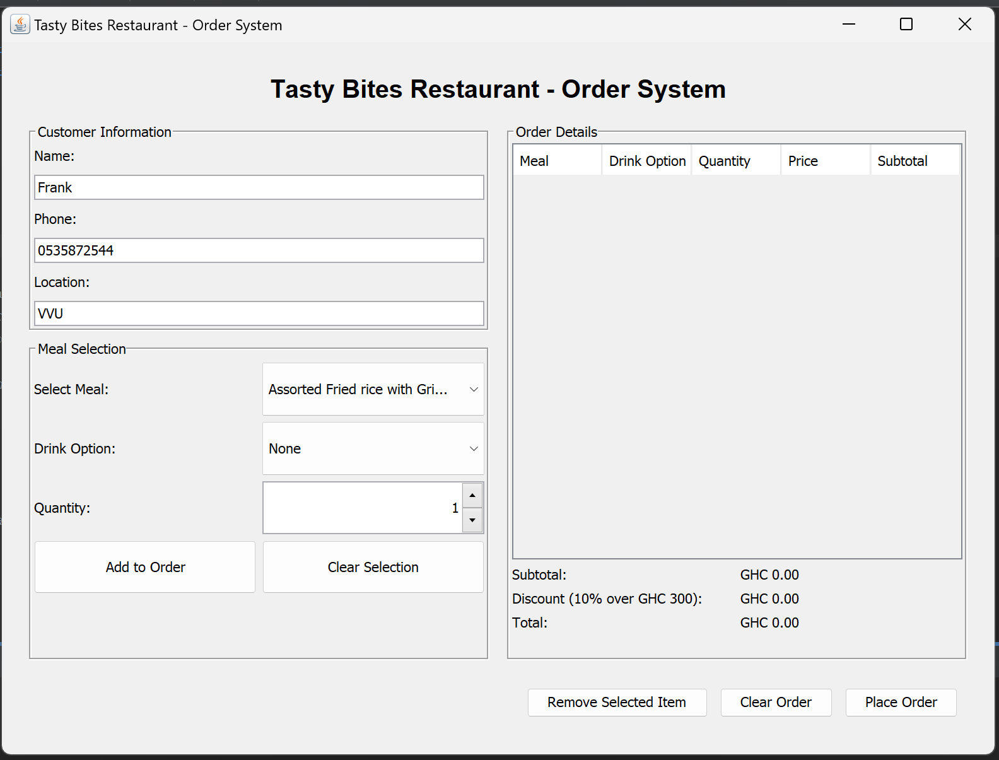
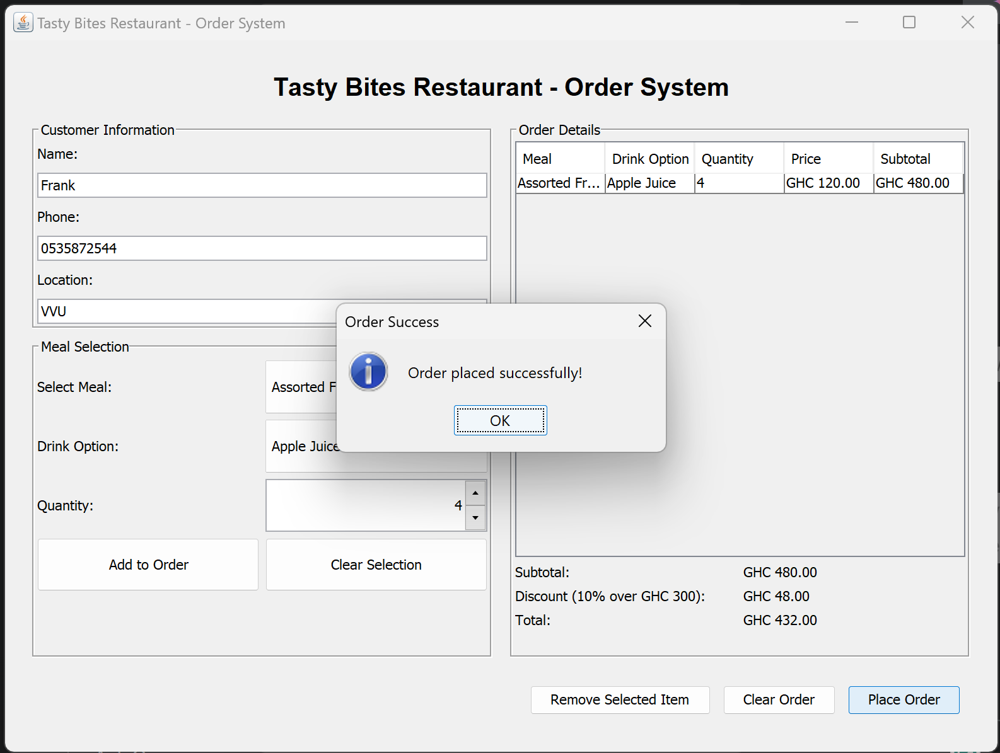
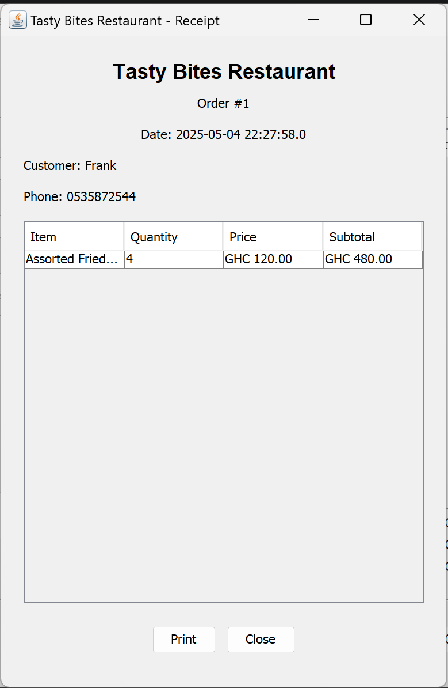
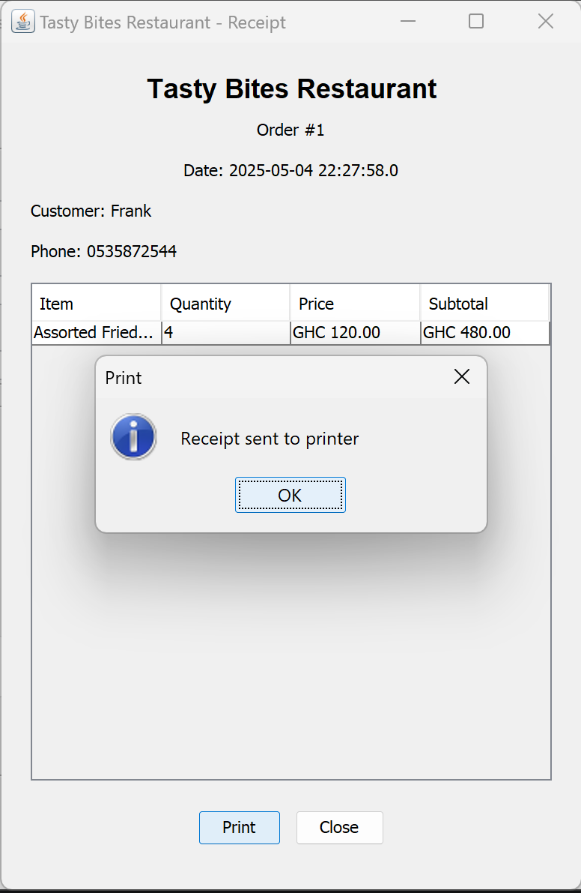

# Tasty Bites Restaurant Management System

A Java Swing application for managing restaurant orders, customer information, and billing.

## Features

- **User Authentication**: Login and registration system for customers
- **Menu Management**: Display of available menu items
- **Order Processing**: Easy order creation with multiple items
- **Drink Options**: Option to add water or apple juice to meals
- **Discount Rules**: Automatic 10% discount for orders over GHC 300
- **Receipt Generation**: Digital receipts for completed orders
- **Database Integration**: MySQL database for storing users, meals, and orders

## System Requirements

- Java Development Kit (JDK) 8 or higher
- MySQL Server 5.7 or higher
- MySQL Connector/J (JDBC driver)

## Database Setup

1. Install MySQL Server on your machine
2. Create a new database named `tasty_bites`
3. The application will automatically create the required tables

## Configuration

Edit the `DBConnection.java` class to update database connection settings:

```java
private static final String DB_URL = "jdbc:mysql://localhost:3306/tasty_bites";
private static final String USER = "root";
private static final String PASS = "password";
```

Replace these values with your MySQL server details.

## Compilation and Running

### Using an IDE (Eclipse, IntelliJ IDEA, NetBeans)

1. Import the project into your IDE
2. Add MySQL Connector/J to your project's classpath
3. Run the `TastyBitesRestaurantSystem` class

### Using Command Line

1. Compile all Java files:
```
javac -cp .:mysql-connector-java.jar *.java
```

2. Run the application:
```
java -cp .:mysql-connector-java.jar TastyBitesRestaurantSystem
```

## Database Schema

The system uses the following tables:

1. **users** - Stores customer information
2. **meals** - Stores menu items and prices
3. **orders** - Stores order header information
4. **order_items** - Stores individual items in each order

## Default Menu

The system comes with the following pre-configured menu items:

| Food | Price Only | Price with Apple Juice | Price with Water |
|------|------------|------------------------|------------------|
| Assorted Fried rice with Grilled Chicken | GHC 100 | GHC 120 | GHC 110 |
| Banku with grilled tilapia | GHC 120 | GHC 140 | GHC 130 |
| Fufu with goat soup | GHC 80 | GHC 100 | GHC 110 |
| Rice balls with Groundnut soup | GHC 85 | GHC 105 | GHC 100 |

## Workflow

1. Customer registers or logs in
2. Staff selects meals and drink options for the order
3. System calculates the total amount and applies discount if applicable
4. Order is stored in the database
5. Digital receipt is generated

##Images










